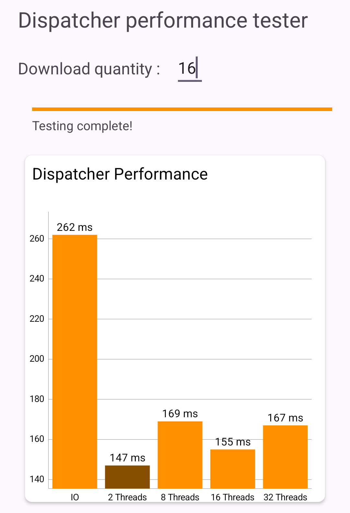
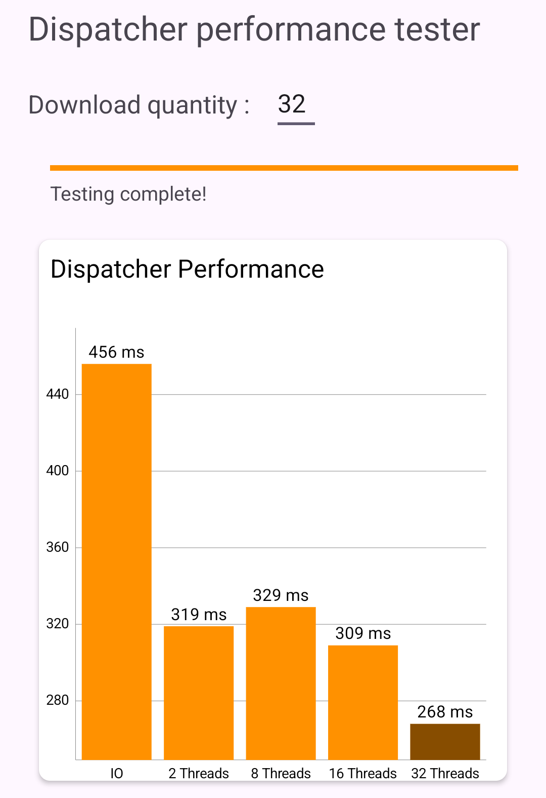
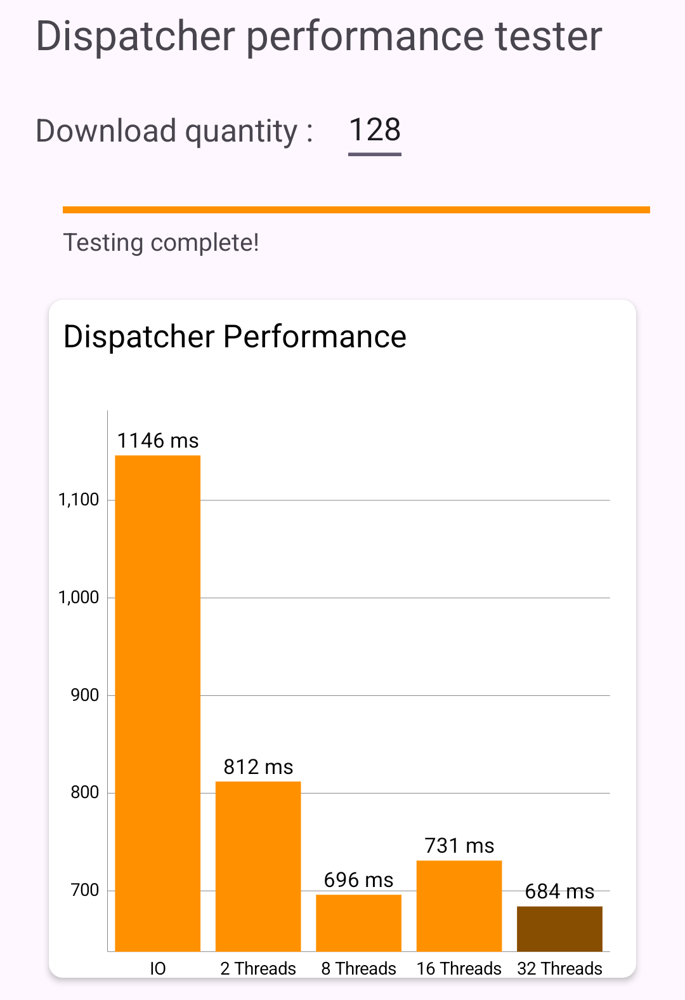

# HEIG_DAA_Labo5

## Introduction


## Choix d'implémentation


### Extra: Implémentation de tests de performance

Nous avons profité de la rallonge du délai de rendu de ce laboratoire pour aller plus loin que la consigne en implémentant une activité dont la tâche est de tester la performance de différents dispatchers et d'afficher les résultats dans un graphe en barres.

#### Activité hôte (`TestActivity`)

Cette activité permet de lancer les tests de performance en cliquant sur le 2e bouton du menu. La méthode `launchTests` va alors lancer les tests dans une coroutine, car nous avons besoin d'afficher la progressBar dans l'activité, donc ces test ne doivent pas être bloquants.

````kotlin
private fun launchTests() {
	//( ... )

	// Prepare the list of URLs for the images to be downloaded
	val items = List(nbDownloads) { URL("${ENDPOINT}${it + 1}${FILE_EXT}") }

	// Initialize the progress bar
	progressBar.apply { max = PerformanceTester.dispatcherPairs.size; progress = 0 }

	// Start the test in a coroutine
	lifecycleScope.launch {
		val testResults = PerformanceTester.testDispatcherPerformance(
			items,
			this,
			lifecycleScope,
			updateUI = { status -> binding.textViewStatus.text = status },
			updateProgress = { progress -> progressBar.progress = progress }
		)
		//( ... )
	}      
}
````


Une fois que nous avons récupéré les résultats des tests, nous les affichons dans le graphique grâce à la méthode `setupBarChart `:

````kotlin
private fun setupBarChart(testResults: List<TestResult>) {
	val entries = ArrayList<BarEntry>() // List to hold bar entries
	val labels = ArrayList<String>() // List to hold axis labels

	testResults.forEachIndexed { index, result ->
		entries.add(BarEntry(index.toFloat(), result.duration.toFloat()))
		labels.add(result.dispatcherName)
	}

	// ( ... )

	barChart.invalidate() // Display the chart
}
````


#### Implémentation des tests (`PerformanceTester`)

Nous avons repris la même logique de téléchargement que dans l'`ImageRecyclerAdapter`, à savoir utilise la classe `ImageDownloader` qui télécharge et décode chaque image récupérée du serveur.

````kotlin
private suspend fun downloadImage(url: URL): Bitmap? {
	return try {
		with(ImageDownloader()){decodeImage(downloadImage(url)!!)}
	} catch (e: Exception) {
		Log.e("ImageDownload", "Error downloading image from $url", e)
		null
	}
}
````


##### Création des `Dispatchers`

Pour pouvoir tester différents `Dispatchers`, nous avons créé une liste contenant le des paires de dispatchers. chaque paire consiste en un nom et son `CoroutineDispatcher` correspondant. Il s'agit notamment de "IO" et  plusieurs custom dispatchers avec un nombre fixe de threads (2, 4, 8, 16) créés à l'aide de `Executors.newFixedThreadPool`.

```kotlin
val dispatcherPairs = listOf(
        "IO" to Dispatchers.IO,
        "2 Threads" to Executors.newFixedThreadPool(2).asCoroutineDispatcher(),
        "4 Threads" to Executors.newFixedThreadPool(4).asCoroutineDispatcher(),
        "8 Threads" to Executors.newFixedThreadPool(8).asCoroutineDispatcher(),
        "16 Threads" to Executors.newFixedThreadPool(16).asCoroutineDispatcher()
    )
```


##### Test des performances

La méthode`testDispatcherPerformance` orchestre le processus de test. Elle accepte une liste d'URL, des `CoroutineScopes` de test et d'interface utilisateur, ainsi que deux fonctions lambda pour les mises à jour de l'interface utilisateur. La fonction itère sur chaque dispatcher, exécute les tâches de téléchargement simultanément pour des URL données et enregistre le temps d'execution.

````kotlin
import kotlinx.coroutines.CoroutineDispatcher as CD
import kotlinx.coroutines.CoroutineScope as CS

suspend fun testDispatcherPerformance(
    items: List<URL>, testScope: CS, uiScope: CS, updateUI: (String) -> Unit,updateProgress: (Int) -> Unit
	): List<TestResult> {
    val results = mutableListOf<TestResult>()

    testScope.async {
        dispatcherPairs.forEachIndexed { index, (name, dispatcher) ->
            uiScope.launch { updateUI("Testing $name dispatcher...") }.join()
            val duration = getDuration(items, dispatcher, testScope)
            results.add(TestResult(name, duration))
            uiScope.launch { updateUI("Testing complete!") }.join()
            uiScope.launch { updateProgress(index + 1) }.join()
        }
    }.await()

    return results
}

private suspend fun getDuration(items: List<URL>, disp: CD, scope: CS): Long {
    val startTime = System.currentTimeMillis()
    scope.launch(disp) { items.map { url -> launch { downloadImage(url) } }.joinAll() }.join()
    return System.currentTimeMillis() - startTime
}
````


## Question 3.1

> *Veuillez expliquer comment votre solution s’assure qu’une éventuelle Couroutine associée à une vue (item) de la RecyclerView soit correctement stoppée lorsque l’utilisateur scrolle dans la galerie et que la vue est recyclée.*


Chaque élément de la RecyclerView est géré par une classe ViewHolder, qui est responsable du lancement et de la gestion de la coroutine pour le téléchargement et l'affichage de l'image associée à cet élément. Voici comment la gestion des coroutines est implémentée :

Dans la classe ViewHolder, une coroutine est démarrée dans la méthode `bind(url: URL)`. Cette coroutine gère le téléchargement et l'affichage de l'image. La coroutine est lancée dans un `LifecycleCoroutineScope` pour garantir qu'elle est liée au cycle de vie de l'activité qui l'héberge.

Pour garantir que chaque élément a une coroutine distincte, une variable `currentUrl` est utilisée. Lorsqu'une nouvelle URL est liée à un `ViewHolder`, il vérifie si cette URL est différente de l'actuelle. Si elle est différente, cela indique que l'élément est sur le point d'afficher une nouvelle image, nécessitant l'annulation de toute coroutine en cours associée à l'image précédente:

```kotlin
        fun bind(url: URL) {
            // Check if the new URL is different from the current one
            if (currentUrl != url.toString()) {
                // Cancel any existing download job for the previous URL
                downloadJob?.cancel()

                // Reset the visibility of the ProgressBar and ImageView
                progressBar.visibility = View.VISIBLE
                image.visibility = View.INVISIBLE

                // Update the current URL
                currentUrl = url.toString()

                // Start a new coroutine for downloading and displaying the image
                downloadJob = scope.launch {
                    val cachedBitmap =
                        getBitmap(url.path.substring(url.path.lastIndexOf('/') + 1), url)
                    updateImageView(cachedBitmap)
                }
            }
        }
```


Le système RecyclerView recycle les vues lorsqu'elles défilent hors de la zone visible. Pour gérer cela, la méthode `onViewRecycled(holder: ViewHolder)` de l'adaptateur est surchargée. Dans cette méthode, la méthode `unbind()` du `ViewHolder` est appelée. Cette méthode est chargée d'annuler toute coroutine active associée au ViewHolder. L'annulation est obtenue en appelant `downloadJob?.cancel()`, qui annule en toute sécurité la coroutine si elle est actuellement active. Cela garantit que tout téléchargement ou traitement d’image en cours est arrêté, libérant ainsi des ressources.

Finalement, dans la méthode `unbind()`, la visibilité de ProgressBar et d'ImageView est réinitialisée. Cela prépare le ViewHolder à la réutilisation avec un nouvel élément, garantissant ainsi un état cohérent. 

```Kotlin
    override fun onViewRecycled(holder: ViewHolder) {
        holder.unbind()
    }
```

```kotlin
        fun unbind() {
            // Cancel any ongoing download job to prevent memory leaks and unnecessary work
            downloadJob?.cancel()

            // Reset the visibility of the ProgressBar and ImageView
            progressBar.visibility = View.VISIBLE
            image.visibility = View.INVISIBLE

            // Clear the current URL since the view is being recycled
            currentUrl = null
        }
```


Grâce à cette implémentation, nous garantissons que toute coroutine associée à un élément RecyclerView est gérée correctement. Lorsqu'un élément est recyclé, sa coroutine associée est annulée, empêchant toute opération en arrière-plan qui n'est plus nécessaire.


## Question 3.2

> *Comment pouvons-nous nous assurer que toutes les Coroutines soient correctement stoppées lorsque l’utilisateur quitte l’Activité ? Veuillez expliquer la solution que vous avez mise en œuvre, est-ce la plus adaptée ?*

Pour aligner notre gestion des coroutines sur le cycle de vie de l'activité, nous avons utilisé le `lifecycleScope`,  un `CoroutineScope` prédéfini lié au cycle de vie de l'activité. Cette portée garantit que toutes les coroutines lancées au sein de celle-ci sont automatiquement annulées lorsque l'activité atteint la phase `onDestroy()` de son cycle de vie.

Bien que `lifecycleScope` annule automatiquement les coroutines sur `onDestroy()`, nous avons encore renforcé ce comportement pour gérer explicitement l'annulation des coroutines. Nous l'avons fait en surchargeant la méthode `onDestroy()` dans notre MainActivity:

````Kotlin
    override fun onDestroy() {
        super.onDestroy()
        if (isFinishing) {
            // This ensures that coroutines are cancelled only when the activity is truly finishing
            lifecycleScope.coroutineContext.cancelChildren()
        }
    }
````


Dans cette implémentation, nous invoquons `CancelChildren()` sur le `CoroutineContext` de `lifecycleScope`. Cette méthode annule toutes les coroutines démarrées dans le lifecycleScope. La vérification `if (isFinishing)` garantit que les coroutines ne sont annulées que lorsque l'activité est réellement terminée et pas seulement en cours de changement de configuration (comme la rotation de l'écran). Cette distinction est importante pour éviter l'annulation prématurée des coroutines, qui pourrait encore être nécessaire si l'activité est simplement recréée.

**Est-ce que cette solution est la plus adaptée?** N'étant pas experts Android, il est difficile de répondre à cette question, cependant nous pouvons apporter quelques éléments de réponse:

* Si nos coroutines doivent se terminer quel que soit le cycle de vie de l'activité (par exemple, la synchronisation des données en arrière-plan qui doit se poursuivre pendant les modifications de configuration), une portée différente comme `ViewModelScope` ou un `CoroutineScope` personnalisé lié au cycle de vie de l'application peut être plus approprié.
*  L'utilisation de `isFinishing` dans `onDestroy()` est cruciale pour faire la différence entre la destruction d'activité due aux changements de configuration et la destruction finale. Si notre application gère les modifications de configuration (comme les rotations d'écran) sans recréer l'activité, notre approche fonctionne bien.
* Pour les tâches ou opérations de longue durée qui doivent survivre à l'activité, nous pouvons envisager d'utiliser un `WorkManager` ou des services.


## Question 3.3

> *Est-ce que l’utilisation du Dispatchers.IO est la plus adaptée pour des tâches de téléchargement ? Ou faut-il plutôt utiliser un autre Dispatcher, si oui lequel ? Veuillez illustrer votre réponse en effectuant quelques tests.*

Comme mentionné dans la partie [Implémentation de tests de performance](#Extra: Implémentation de tests de performance), nous avons mis en place une activité permettant de faire des tests de performance concernant plusieurs dispatchers. Voici les résultats de nos tests:

Avec 16 images téléchargées en parallèle, nous voyons clairement que le dispatcher IO est le plus lent




Avec 32 images téléchargées en parallèle, le dispatcher custom de 16 threads est le plus rapide




Avec 64 images téléchargées en parallèle, le dispatcher custom de 16 threads est encore le plus rapide


Avec 128 images téléchargées en parallèle les dispatchers custom de 4, 8 et 16 threads sont les plus rapides



Nous pouvons en tirer la conclusion que, bien qu'il soit le dispatcher recommandé pour ce genre de tâche, l’utilisation du Dispatchers.IO n'est pas forcément la plus adaptée. Dans notre cas un dispatcher avec un thread pool de 16 est systématiquement plus rapide.


## Question 3.4

> *Nous souhaitons que l’utilisateur puisse cliquer sur une des images de la galerie afin de pouvoir, par exemple, l’ouvrir en plein écran. Comment peut-on mettre en place cette fonctionnalité avec une RecyclerView? Comment faire en sorte que l’utilisateur obtienne un feedback visuel lui indiquant que son clic a bien été effectué, sur la bonne vue.*


Nous avons déjà implémenté ce genre de feature dans le labo précédent (cliquer pour éditer une note dans une recyclerView), et la procédure est très similaire.

### Afficher l'image en plein écran:

Nous allons créer une interface qui nous permettra de propager le clickListener vers la MainActivity:

````kotlin
interface OnItemClickListener {
    fun onItemClick(position: Int, items: List<URL>)
}
````

Ensuite dans notre MainActivity, nous allons implémenter le clickListener de notre interface. Dans ce click listener, nous allons récupérer l'url de l'image et lancer une nouvelle activité. Le fait de récupérer l'url, nous permettrait (en fonction de l'API) d'afficher une version haute résolution de l'image.

````
class MainActivity : AppCompatActivity(), OnItemClickListener{
// ( ... )
    override fun onItemClick(position: Int, items: List<URL>) {
        val imageUrl = items[position].toString()
        val intent = Intent(this, FullScreenImageActivity::class.java)
        intent.putExtra("IMAGE_URL", imageUrl)
        startActivity(intent)
    }
// ( ... )
}
````


Maintenant, créons notre activité d'affichage de l'image, avec son layout. Dans cette activité nous avons utilisé [glide](https://github.com/bumptech/glide), une librairie qui nous permet de charger et afficher des images depuis différentes sources. `glide` prends en charge le caching, la gestion de la mémoire et le décodage de l'image.

````kotlin
class FullScreenImageActivity : AppCompatActivity() {

    override fun onCreate(savedInstanceState: Bundle?) {
        super.onCreate(savedInstanceState)
        setContentView(R.layout.activity_full_screen_image)

        val imageUrl = intent.getStringExtra("IMAGE_URL")

        // Use Glide to load the image
        Glide.with(this).load(imageUrl).into(findViewById(R.id.fullScreenImageView))
    }
}
````


````xml
<FrameLayout xmlns:android="http://schemas.android.com/apk/res/android"
    android:layout_width="match_parent"
    android:layout_height="match_parent">

    <ImageView
        android:id="@+id/fullScreenImageView"
        android:layout_width="match_parent"
        android:layout_height="match_parent"
        android:scaleType="centerCrop"/>
</FrameLayout>
````


finalement, dans notre adapter, nous allons implémenter le ClickListener des éléments de la RecyclerView pour récupérer la position de l'élément sur lequel nous avons cliqué:

````kotlin
class ImageRecyclerAdapter(urls: List<URL> = listOf(), private val scope: LifecycleCoroutineScope, private val itemClickListener: OnItemClickListener) :
    RecyclerView.Adapter<ImageRecyclerAdapter.ViewHolder>() {
	// ( ... )
        
    inner class ViewHolder(view: View) : RecyclerView.ViewHolder(view) {
        init {
            view.setOnClickListener {
                val position = adapterPosition
                if (position != RecyclerView.NO_POSITION) {
                    itemClickListener.onItemClick(position, items)
                }
            }
        }
	//( ... )
}
````


### Ajouter un feedback

Nous avons d'abord essayé d'utiliser un ripple effect, mais cette méthode n'a pas fonctionné. Nous avons alors opté pour une animation que nous avons implémenté sur le ClickListener de chaque item de la RecyclerView dans le block `init` du `ViewHolder`:
````Kotlin
init {
	view.setOnClickListener {
	// Scale animation for visual feedback
		view.animate().scaleX(0.9f).scaleY(0.9f).setDuration(200).withEndAction {
			view.animate().scaleX(1f).scaleY(1f).setDuration(200).start()
		}
		// ( ... )
	}
}
````


## Question 4.1

> *Lors du lancement de la tâche ponctuelle, comment pouvons-nous faire en sorte que la galerie soit rafraîchie ?*

Il suffit d'appeler `adapter.notifyDataSetChanged()` pour rafraichir la galerie:
````kotlin
    private fun manualClearCache() {
        val clearCacheWork = OneTimeWorkRequestBuilder<ClearCacheWorker>().build()
        WorkManager.getInstance(this).enqueue(clearCacheWork)
        adapter.notifyDataSetChanged() // Refresh the gallery
        Toast.makeText(this, "Cache cleared", Toast.LENGTH_LONG).show()
    }
````


## Question 4.2

> *Comment pouvons-nous nous assurer que la tâche périodique ne soit pas enregistrée plusieurs fois ? Vous expliquerez comment la librairie WorkManager procède pour enregistrer les différentes tâches périodiques et en particulier comment celles-ci sont ré-enregistrées lorsque le téléphone est redémarré.*


### Explications concernant le fonctionnement du `WorkManager`

WorkManager gère les tâches asynchrones différées qui nécessitent une exécution fiable. Elle est particulièrement utile pour les tâches qui doivent continuer à s'exécuter même si l'application se termine ou si l'appareil redémarre.

Il planifie des tâches périodiques à l'aide du `PeriodicWorkRequest` qui se répètent à des intervalles définies. Lorsque nous planifions une tâche périodique, le `WorkManager` s'assure que cette tâche s'exécute de manière répétée à l'intervalle spécifié. Chaque exécution du travail est traitée comme une tâche distincte. Il offre également une grande flexibilité dans l'exécution des tâches. Par exemple, si un appareil redémarre ou si l'application est tuée, il s'assure que le travail périodique est reprogrammé en fonction des contraintes et des intervalles définis.

#### Persistance et redémarrage du téléphone

Le `WorkManager` utilise une base de données (SQLite) pour persister les work request. Quand nous mettons en queue une work request, il la stocke dans sa base de données. Grâce à son mécanisme de persistance, Il peut rescheduler et poursuivre le travail en attente même après le redémarrage du téléphone. Il écoute les émissions système de démarrage BOOT_COMPLETED pour savoir quand l'appareil est redémarré. Au redémarrage de l'appareil, Le `WorkManager` vérifie dans sa base de données les travaux non terminés ou en attente. Il reschedule ensuite ce travail en fonction des work request enregistrées et de leurs contraintes.

### S'assurer que la tâche ne soit pas ré-enregistrée

Pour éviter qu'une tâche périodique ne soit enregistrée plusieurs fois dans WorkManager il est possible d'identifier les work request de manière unique. WorkManager nous permet d'attribuer un nom unique à nos work request et de déterminer ce qu'il faut faire s'il existe une work request portant le même nom en utilisant la méthode `enqueueUniquePeriodicWork`.

Cette méthode permet de spécifier un nom unique pour notre work request et de définir une `ExistingPeriodicWorkPolicy`. La méthode `ExistingPeriodicWorkPolicy` détermine ce qui se passe s'il existe déjà un travail périodique portant le même nom unique :

* REPLACE: s'il existe une work request en attente portant le même nom unique, elle sera annulée et la nouvelle work request remplacera l'ancienne.
* KEEP : La nouvelle work request ne sera pas mise en file d'attente.

Dans notre implémentation:
````kotlin
class MainActivity : AppCompatActivity(), OnItemClickListener {

    companion object {
        // ( ... )
        const val uniqueWorkName = "ClearCachePeriodicWorkLabo5"
        val WM_POLICY = ExistingPeriodicWorkPolicy.KEEP
        val UNIT = TimeUnit.MINUTES
    }
    
    // ( ... )
    
    // Bind the periodic cache clear
	val clearCacheRequest = PeriodicWorkRequestBuilder<ClearCacheWorker>(INTERVAL, UNIT).build()
	val wm = WorkManager.getInstance(this)
	wm.enqueueUniquePeriodicWork(uniqueWorkName, WM_POLICY, clearCacheRequest)
	
	// ( ... )
}
````


